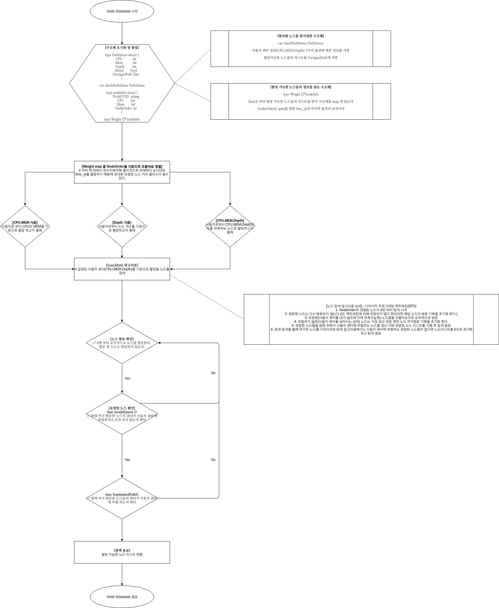
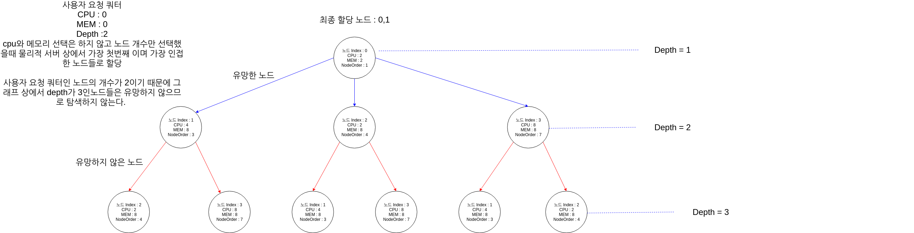
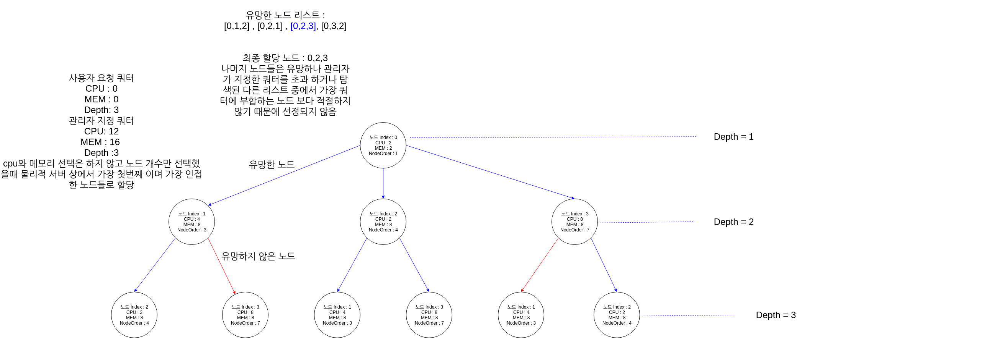

[](http://118.130.73.5:8100/iitp-sds/violin-scheduler/pipelines)

[](http://118.130.73.5:8100/iitp-sds/violin-scheduler/commits/master)

[](http://118.130.73.5:8100/iitp-sds/hcloud-badge/raw/feature/dev/goreport_violin-scheduler)


# violin-scheduler

## 개발 현황

```shell
Rack Awareness 를 고려한 알고리즘은 아니기 때문에 단일 Rack에서의 노드 선택 알고리즘이다. 추후 복수의 Rack을 고려한 알고리즘은 위해 가중치를 계산식을 구축해야 한다. 
```


### 노드 스케쥴러 알고리즘 이란?

### 알고리즘 순서도



### 알고리즘 예시 1



### 알고리즘 예시 2



## GraphQL

### 알고리즘 graphql 예시

#### 1. 노드만 선택시

```shell
mutation _ {
  schedule_nodes(server_uuid: "qweqweqweqwe", cpu: 1, memory: 4, user_uuid: "1234",number_of_nodes: 4) {
    server_uuid
    cpu
    memory
    user_uuid
    number_of_nodes
  }
}


// selected nodes uuid list return
//Json Type
mutation _ {
  schedule_nodes(server_uuid: "qweqweqweqwe", cpu: 0, memory: 0, nr_node: 2) {
    node_uuid
  }
}


//String type
mutation _ {
	selected_nodes (server_uuid: "qweqweqweqwe", cpu: 0, memory: 0, nr_node: 2)
}
```

